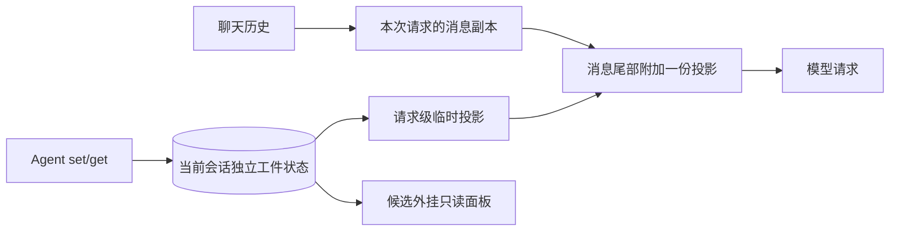

# 工件区：设计澄清与接入依据

**状态**：规格与五张票已整体确认并发布，2026-10-10。本文区分已接受的目标、已核实的源码事实与实现方案；不是实现完成或用户验收记录。实际编号见 [开票索引](artifact-zone-tickets.md)。

后续 [#27 发行版核验](artifact-host-capabilities.md) 已完成，当前正式插件能力不足。下面的公开源码审查是设计时依据；当前安装包的静态对照与隔离运行证据单独留在核验报告中。

## 已接受的目标

- 每个会话独立一份工件区，父子会话通过引用关联，各自维护。
- 工件真实状态独立持久化，支持重启恢复；自动投影不写入 ZCode 聊天历史，也不提交 Git。
- 每个实际模型请求读取最新状态，包括同一轮中的工具续跑。set 成功后，下一次模型请求必须看到变化。
- 同一模型请求只附加一份最新工件投影，并位于消息尾部。旧自动投影不能随历史再次发送。
- 唯一性仅约束自动投影；set/get 调用记录与正常聊天按原有机制保留，工具回执保持简短。
- Agent 使用 set/get 管理状态，通常可直接使用投影，省去 get。提示词需引导 Agent 主动维护适当引用，例如 PR、父子会话、关键文档/文件。
- Agent 根据后续用途移除失效引用；服务同时限制条目数和投影体积，超限时明确拒绝写入并要求清理。
- 数量上限为 20 条，生成后的完整投影最多 12000 个 Unicode 字符；字符数不等于 token 数。
- set 只发送变动条目，支持批量 upsert（新增或更新引用）与 remove（移除引用），并检查 revision。成功回执只给新版本与变动数量。
- 分叉时复制父会话工件作为子会话独立初始状态，之后各自维护、互不自动同步。普通新会话从空集合开始；恢复和压缩保留状态，回退聊天不自动回滚工件。
- 外挂面板作为可选后续票，首版核心不依赖面板完成。
- 在现有 app-mcp 中新增 get_artifacts/set_artifacts，只操作宿主上下文确定的当前会话。
- 条目仅含 kind/ref/label/purpose；kind 固定为 pr、session、file、link 四类，按 ref 更新或移除。
- 投影尾部指整个模型请求的 messages 数组末端。
- 保持独立插件、不修改 ZCode 的边界。若发行版没有合适入口，将上游支持列为前置依赖。

术语见 [CONTEXT.md](../../CONTEXT.md)，已接受的架构选择见 [ADR 0001](adr/0001-session-artifact-projection.md)。

## 已核实的源码事实

**本节范围仅限仓库钉定的公开快照**：ZCode `29628c9acdb81b703bbd4080c207a0e7ce5e276e`，对应公开 3.14.3 快照。设计阶段未启动本机 ZCode；后续核验启动的是隔离 AgentServer，未修改安装文件或操作原活动会话。

| 入口 | 已核实行为 | 对目标的影响 |
| --- | --- | --- |
| UserPromptSubmit | 在 turn 中运行，返回 additionalContexts 后调用消息历史注入函数 | 不是每个模型请求的刷新入口 |
| Hook 上下文注入 | 将 hook_context 附件追加到 messageHistory | 不写数据库并不意味着运行时历史没有旧投影 |
| 消息历史 addEntries | 追加 entries，不按工件标识替换 | 重复调用自身不保证唯一性 |
| Context 刷新 | 保留前缀之外的 canonicalConversationEntries | 不能把刷新前缀等同于清除旧 Hook 附件 |
| Provider 请求投影 | 对输入 entries 重排、渲染；所读路径没有按工件标识替换旧投影 | 需验证最终请求体，而非只看 Hook 输出 |
| 配置型 Hook 契约 | 公开事件及 JSON 输出未声明请求级临时尾部状态槽 | 不能直接宣称现有配置型 Hook 满足严格目标 |
| 模型循环的请求副本 | turn-loop 在调用 Provider 投影前复制 turnRequestState.entries | 宿主内部存在请求构造边界，但不等于插件可调用该边界 |
| 分叉身份 | child.parentID 与 forkOrigin 保存父会话及消息锚点 | 能证明来源，不等于包含插件工件快照 |
| 分叉提交与事件 | commitForkBundle 后追加 SessionForked；公开配置型 Hook 契约没有分叉事件 | 尚未证实插件可以在分叉操作中冻结并复制工件状态 |

固定版本依据：

- [UserPromptSubmit 的调用与注入](https://github.com/zai-org/ZCode/blob/29628c9acdb81b703bbd4080c207a0e7ce5e276e/apps/zcode-cli/packages/core/src/runtime/methods/turn.ts#L361-L423)
- [Hook 附件进入消息历史](https://github.com/zai-org/ZCode/blob/29628c9acdb81b703bbd4080c207a0e7ce5e276e/apps/zcode-cli/packages/core/src/runtime/methods/hooks.ts#L106-L117)
- [addEntries 的追加行为](https://github.com/zai-org/ZCode/blob/29628c9acdb81b703bbd4080c207a0e7ce5e276e/apps/zcode-cli/packages/core/src/agent/message-history.ts#L164-L177)
- [Context 刷新保留会话 entries](https://github.com/zai-org/ZCode/blob/29628c9acdb81b703bbd4080c207a0e7ce5e276e/apps/zcode-cli/packages/core/src/runtime/methods/context-refresh.ts#L37-L49)
- [Provider 请求构造](https://github.com/zai-org/ZCode/blob/29628c9acdb81b703bbd4080c207a0e7ce5e276e/apps/zcode-cli/packages/core/src/runtime/helpers/provider-request-messages.ts#L48-L98)
- [Hook 事件](https://github.com/zai-org/ZCode/blob/29628c9acdb81b703bbd4080c207a0e7ce5e276e/apps/zcode-cli/packages/contracts/src/hooks/index.ts#L7-L15)与 [Hook 输出契约](https://github.com/zai-org/ZCode/blob/29628c9acdb81b703bbd4080c207a0e7ce5e276e/apps/zcode-cli/packages/contracts/src/hooks/index.ts#L163-L206)
- [模型循环中的请求 entries 副本](https://github.com/zai-org/ZCode/blob/29628c9acdb81b703bbd4080c207a0e7ce5e276e/apps/zcode-cli/packages/core/src/runtime/methods/turn-loop.ts#L162-L190)
- [分叉 parentID](https://github.com/zai-org/ZCode/blob/29628c9acdb81b703bbd4080c207a0e7ce5e276e/apps/zcode-cli/packages/core/src/runtime/methods/session-fork.ts#L147-L173)、[forkOrigin](https://github.com/zai-org/ZCode/blob/29628c9acdb81b703bbd4080c207a0e7ce5e276e/apps/zcode-cli/packages/core/src/runtime/methods/session-fork.ts#L403-L442)、[分叉提交后事件](https://github.com/zai-org/ZCode/blob/29628c9acdb81b703bbd4080c207a0e7ce5e276e/apps/zcode-cli/packages/core/src/runtime/methods/session-fork.ts#L737-L790)

**设计时可行性判断**：状态存储、set/get 工具和提示词均可由插件设计。严格的自动投影还依赖宿主接入能力；设计时静态核查不足以确认本机发行版支持。后续隔离核验已给出能力不足的结论，不能把整个功能记为可直接落地。

## 桌面与外挂面板调研

**调研后已决定：外挂只读面板作为可选后续票**。尚未授权面板实施；首版核心的投影与工具不依赖它。

| 路线 | 结论 | 限制 |
| --- | --- | --- |
| 插件注册 ZCode 原生侧栏 | 公开 3.14.3 契约与装配链没有该入口；本机 3.14.5 静态复核未找到新增扩展证据 | 字面量扫描不能排除私有入口，尚未做运行时注册验收 |
| 复用工作流产物侧栏 | 宿主已有该组件，但绑定工作流 run 与 artifact journal | 不能直接承诺第三方会话工件列表可接入 |
| 插件配套的外置网页面板 | 可设计为按需本地进程提供界面，用户显式选择会话，共用工件持久状态 | 尚未实现或实测原型；它不解除请求级投影的入口前置依赖 |
| 自动跟随 ZCode 当前会话 | 已审查的公开接口中未找到当前选择事件 | Renderer 的 activeTaskId、MCP 来源与列表 membership.active 是不同概念，不能互相代替 |

原始证据与版本边界见 [原生面板研究](artifact-panel-native-research.md) 和 [外挂面板研究](artifact-panel-external-research.md)。两份面板研究的安装包核查仅为静态依据；请求投影路径的后续隔离运行验证另见 [发行版核验报告](artifact-host-capabilities.md)。

**外置面板本身无需调用模型**。网页展示与刷新可由本机进程完成；增加面板不会要求把界面刷新写成 Agent 对话。但外置浏览器不能直连现有公共网关：网关要求本机 token 并拒绝浏览器 Origin，必要 Host 操作应由进程端代调用。

候选最小界面是会话选择器与只读工件列表，支持普通网页链接、面板内切换关联会话、复制文件路径。跳转 ZCode 内部会话、系统打开文件和自动跟随都需另行验证，不先承诺。

## 成功标准

以下为已确定目标对应的验收条件，尚未执行：

1. 连续发送两轮用户输入，以及同轮多次工具续跑时，每个实际模型请求的自动工件投影都只有一份。
2. set 成功后，下一次请求的投影使用新状态，不包含旧自动投影；其它历史工具记录不计为自动投影。
3. 实际发送到模型的消息中，工件投影处于约定的尾部位置；具体 role、内容块位置及 provider 兼容方式仍待确定。
4. ZCode 持久化聊天历史不保存自动投影；恢复会话后，从独立状态重建投影。
5. 两个会话的工件状态互不覆盖；父子会话引用不意味着共享写入同一集合。
6. 超过条目数或投影体积限制时，set 明确失败，旧状态保持完整，没有静默截断或自动删除。
7. 用代表性任务验证 Agent 能主动添加重要引用、更新已有引用、清理失效引用。技术上的数量限制可以做契约测试；Agent 的主动维护需要另外验证模型行为。
8. 增量 set 在同一原子更新中检查版本、容量并保存；冲突或超限均不改变旧状态，成功回执不回传完整集合。
9. 分叉时冻结父会话当前工件状态并复制给子会话；父会话随后更新不影响副本。新建、恢复、压缩和回退按上述生命周期规则执行。

## 开票前置顺序

**第一张应是宿主能力验证票**：固定本机发行版与实际加载的 CLI 路径，在隔离会话和合成状态下核查请求级入口、最终请求体、运行时历史、持久化历史以及 set 后续跑刷新；同时核实分叉身份与分叉时点的可用入口。验证日志首次执行即落盘，不修改真实会话或用户设置。

若入口缺失，明确记录上游所需契约与依赖，后续严格投影接入票保持受阻状态。本次已确认状态工具票也依赖请求级投影与分叉快照入口均证实可用；不能把接入缺口标为已解决。

## 已确定的类型

| kind | 目标 | 用途说明 |
| --- | --- | --- |
| pr | PR URL | 创建、评审或后续查看相关 PR |
| session | ZCode 会话 ID | 父、子或关联会话的作用写入 purpose |
| file | 文件绝对路径 | 包括本地规格、交接文档和其它关键文件 |
| link | 其它网页 URL | 在线文档、Issue、部署页面等 |

## 规格与实现方案

[工件区规格](artifact-zone-spec.md)已汇总整体确认的规则与管理提示词；[开票索引](artifact-zone-tickets.md)按可验证行为给出依赖、验收与实际 Issue 编号。

插件自有 SQLite、Unicode 码点计数、无变化不增加 revision，以及归档不自动删除状态，均已整体确认。后续核验已证实当前正式插件缺少满足目标的请求级入口和分叉快照契约；等待具名上游支持与版本，不把设计方案写成已解决的接入能力。

## 状态与投影的目标关系

以下图示表达已确定的状态所有权与投影目标；实施仍以上游提供并验证请求级入口为前置条件。

## Token 成本边界

**增量 set 只能减少更新工具重复发送工件的成本**。每个模型请求附带完整最新投影仍有上下文成本；唯一投影避免的是旧自动快照累积，并不意味着状态内容无需计入模型输入。

容量上限用于防止无限增长。日常条目应只含引用和简短用途，避免复制文档、文件正文或聊天摘要。字符上限不等于 token 上限；本轮没有运行 tokenizer，也不承诺具体 token 数或缓存节省比例。

## 管理提示词

已确认的完整提示词见 [工件区规格](artifact-zone-spec.md)，包括主动登记条件、增量更新、冲突处理、交付物保留和失效引用移除。提示词的模型行为效果需另外评估，不把数量上限或 formatter 测试当作主动维护已通过的证据。
