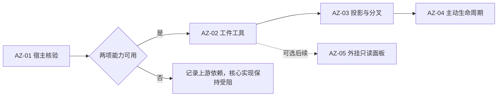

# 工件区开票索引

**状态**：已确认并发布五张 GitHub Issues，2026-10-10。已回读核对正文与依赖编号；尚未实施，创建 Issues 的授权不包含代码实施。

#27 宿主核验已完成，当前正式插件能力不足；见 [核验报告](artifact-host-capabilities.md)。#28–#30 等待上游请求级投影及分叉状态绑定能力，不能仅因调研票关闭而开始实施。

2026-10-10 已给当时全部开放 Issues（#28–#31）添加 `wait-for-upstreaming`，保留原有 `enhancement` 并回读核验。#31 仍是可选后续，不因标签变更而默认实施。

父规格：[工件区规格](artifact-zone-spec.md)，公开全文附于 [GitHub #27](https://github.com/ONEGAYI/ZCode-Plugins/issues/27)。当前开票入口见 [开票约定](agents/issue-tracker.md)。

## 顺序与交付

| 本地票 | GitHub Issue | 交付行为 | 前置条件 |
| --- | --- | --- | --- |
| [AZ-01](artifact-zone-tickets/01-host-capabilities.md) | [#27](https://github.com/ONEGAYI/ZCode-Plugins/issues/27) | 核实发行版是否支持严格投影和分叉快照 | 无；先做隔离验证 |
| [AZ-02](artifact-zone-tickets/02-state-tools.md) | [#28](https://github.com/ONEGAYI/ZCode-Plugins/issues/28) | Agent 能按当前会话增改删工件并恢复状态 | #27，且两项宿主能力均已证实可用 |
| [AZ-03](artifact-zone-tickets/03-request-projection.md) | [#29](https://github.com/ONEGAYI/ZCode-Plugins/issues/29) | 每个请求获得唯一最新尾部投影，分叉得到独立副本 | #28；保持 #27 的宿主能力条件 |
| [AZ-04](artifact-zone-tickets/04-agent-lifecycle.md) | [#30](https://github.com/ONEGAYI/ZCode-Plugins/issues/30) | Agent 按提示词主动登记、维护和移除引用 | #29 |
| [AZ-05](artifact-zone-tickets/05-optional-panel.md) | [#31](https://github.com/ONEGAYI/ZCode-Plugins/issues/31) | 用户在可选外挂面板显式选择会话查看工件 | #28；可选后续，不阻塞首版 |

**关闭调研票不等于解除能力条件**。AZ-01 若证实缺少入口，AZ-02/03/04 不进入 ready-for-agent；在发布后的依赖中补充具名上游支持票或目标版本，等待能力可用。未经用户授权，不向上游发票、不修改 ZCode 或 sources。

每张功能票包含必要的状态、接口、接入和测试，围绕可验证行为交付。没有为数据库、后端、UI 分别建立水平层票，也没有为本次功能预先安排无证据的重构。

## 已整体确认的决定

- 增量 set、当前会话 get、四类条目与容量规则是否与预期一致。
- 分叉使用操作时快照，归档不自动删除工件，回退不回滚工件。
- 采用插件自有 SQLite；按 Unicode 码点计算容量，无变化不增加 revision；投影失败明确阻止携带未知状态的模型请求。
- 先验证宿主入口，能力缺失时等待上游；外挂面板保持可选后续。

截至开票时只核对设计、源码依据、文档路径、格式和公开票正文；没有运行宿主探针、MCP 新工具测试或模型行为评估。

## GitHub 发布格式

已按用户明确授权发布上述五张票。#27 正文附可折叠的规格全文，后续票通过它的实际 Issue 编号引用规格与依赖；未额外创建规格母票，GitHub 正文不依赖本地文档的推送状态。研究依据使用固定提交的公开源码链接，五张票保留仓库既有 `enhancement` 标签；开放的 #28–#31 另按用户要求增加 `wait-for-upstreaming`，阻塞与可选状态同时写在正文。
