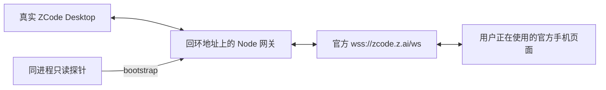

# 设备侧 relay 网关：真实共存验证

**结论**：ZCode 3.14.4 的桌面设备连接经过本地网关后，官方手机页面与同一网关内的 `bootstrap()` 元数据读取可以共存。2026-10-07 实测六次本地读取全部成功，后续独立观察约 47 秒没有新增 `waiting` 或设备重新鉴权。

这项结论限于 bootstrap。改名、提交 prompt、完整 V4 RPC 分流，以及手机离线时的本地调用尚未验证。正式 `list_sessions`、`read_session` 仍直接读取 SQLite，本轮没有接入新的 MCP 工具。

## 实际运行链路

用户确认完整退出 ZCode，进程检查确认旧进程全部结束。随后以进程级 `ZCODE_WEB_REMOTE_CONTROL_RELAY_WS_URL` 启动新主进程。TCP 检查确认 Desktop 连向回环网关，网关连向上游 TLS；官方 relay 返回了真实设备 `auth_ack`。

用户随后报告手机已重新连接，可以查看会话。本地探针没有创建另一个 `terminal` 连接；授权仍由 Desktop 处理，探针没有读取授权链接或保存的凭据。

这次测试涉及重启，旧 resident Host 已经过退出流程。它验证的是**新主进程内的共存**，没有验证把原运行中 Host 的现有连接无损迁移到网关。

## 验证结果

| 检查 | 结果 |
| --- | --- |
| 本地 bootstrap | 六次成功，均返回 11 个工作区、118 条会话元数据 |
| 手机消息往返 | 观察段内入站计数 468 → 883，出站计数 454 → 856 |
| 独立连续观察 | 47.196 秒，配对保持 `matched` |
| 观察窗口内配对 ACK | `matched` 新增 4 次，`waiting` 新增 0 次 |
| 观察窗口内设备重新鉴权 | 0 次 |
| 网络错误回调 | 0 次 |
| 网关契约测试 | 5 项通过，新增观察接口只输出协议类型、方向、状态和本地归属 |

工作区和会话数量来自远控 bootstrap 的视图，不代表 SQLite 工具所覆盖的全部索引。手机流量计数也不能证明每条 V4 RPC 都成功。

**保留的异常**：较早一次读取后的观察段曾新增两次 `waiting`，随后恢复 `matched`。没有逐次状态变更时间和手机操作记录，原因未判定，不能把整个测试阶段描述为全程没有断开。后续独立观察窗口没有重现这一状态变化。

结构化记录见 [脱敏实测证据](relay-gateway-coexistence-evidence.json)。只保留计数和结果，不保存凭据、标识符或聊天正文。

## 初始化与继续研究

首次接入网关需要完整退出 Desktop，然后在带有 relay 覆盖变量的新环境中启动。关闭窗口可能只是隐藏到托盘。运行中配置、自动重连和已查明的内部 `relaunchApp` 命令，都没有传入新 relay 环境的入口。

覆盖变量影响这次启动的主进程及其后代；没有改注册表或持久配置。应用内部重启仍可能继承该变量。恢复默认地址需要完整退出，再从不带覆盖变量的环境启动。

**测试已收尾**：用户自行重启后，TCP 检查确认当前主进程有连向官方域名的 TLS 连接，没有本地网关连接。临时网关正常退出，退出码 0；17329 端口已释放。当前保留的是用户重启后的桌面进程。

下一项应验证 V4 workspace bridge 与 RPC 的共同使用，包括单一 `currentBridge`、数字请求 ID、订阅、session/generation 和 ACK。bootstrap 的外层 `requestId` 分流不能代替这些协议。手机离线时的虚拟 `matched` 也是独立的待验证问题。

## 证据来源

- 本轮实际运行 ZCode 3.14.4；网关使用 Node 24.15.0、ws 8.22.0。固定安装包 SHA-256 与阶段定位保留在 [历史证据](../experiments/relay-gateway/evidence.json)。网关实现与配置已统一迁入 [公共子项目](../../suian-zcode-gateway/README.md)，本报告的 bootstrap 结论范围不变。
- 固定 3.14.4 ASAR 的 `out/main/index.js`：第 1367 行 offset 708268 启动读取覆盖变量，708672 的 endpoint factory 捕获该值；第 408 行 offset 376088 的连接使用构造时 `relayWsUrl`。offset 为 UTF-16 字符偏移。
- 同产物第 1368 行 offset 718200：内部重启回调执行 `prepareAppQuit → app.relaunch → app.quit`，未接收新环境参数。公开快照的 [重启回调](https://github.com/zai-org/ZCode/blob/29628c9acdb81b703bbd4080c207a0e7ce5e276e/packages/desktop/src/main/index.ts#L1349-L1371) 仅作补充，版本为 3.14.3。
- [公开窗口关闭分支](https://github.com/zai-org/ZCode/blob/29628c9acdb81b703bbd4080c207a0e7ce5e276e/packages/desktop/src/main/desktopWindowLifecycle.ts#L379-L411)：Windows 下关闭窗口可能隐藏到托盘，与完整退出不同。
