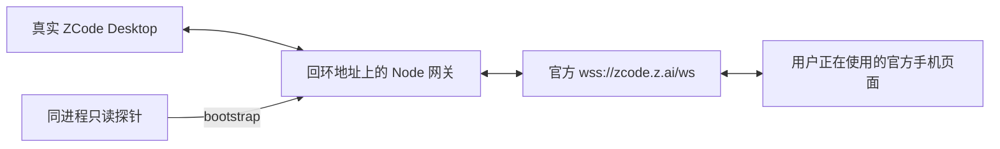

# 设备侧 relay 网关：真实共存验证

**2026-10-08 本地工作区 RPC 共存实测通过**。升级并重载新版网关后，MCP 发信、原 Host 改名读回和固定标记回复读取均成功；用户确认手机无需刷新或重新连接，仍可直接操作。命名插件的 probe、doctor 也通过。完整 Stop Hook 后台命名与手机同用尚未实测，不能把本轮范围扩大到所有命名与远端工作区场景。

下方分别记录新版验收与历史实验。正式 `list_sessions`、`read_session` 直接读取 SQLite，不占远控席位；它们的成功不能代替原 Host RPC 共存验证。

## 新版 RPC 分流：隔离验证

新版提供经本地 Bearer 鉴权的 `/rpc`，MCP 与命名 worker 默认连接公共网关，不再新增官方 terminal。手机的桥身份与 RPC 编号保留在自己的通道；多个本地工作区复用窗口级 Local Host 的一个物理桥，各客户端编号单独映射。取消和订阅按归属转发，正文保持原序列化字节。

2026-10-08 的隔离回归共 150 项通过（公共层 73、MCP 40、命名 37）。新增契约覆盖同编号三方调用、其他本地工作区、事件与取消、长消息分片、手机离线时的临时配对、初始化超时、畸形帧与损坏正文、Host 桥降级、过期工作区切换、官方鉴权失败与非致命错误恢复、非法升级请求、旧网关拒绝回退、本地入口鉴权和 status 不解密旧凭据。这些测试使用模拟 Desktop 与 relay，不连接真实账号，也不消耗重置卡。

手机独用远端工作区时原通道保留，本地 RPC 明确返回 `remote_workspace_busy`；本地调用进行中手机切换远端同样让位，待调用结束后可切换。该限制来自本版只分流窗口级 Local Host，不能据此宣称远端 Host 也支持混用。

## 新版部署与手机验收

用户确认完整退出 ZCode 后，将 [PR #6](https://github.com/ONEGAYI/ZCode-Plugins/pull/6) 合并到 master，部署基线为 `40d0b63`。更新锁定依赖，执行公共 Restart 正常结束旧网关并加载新版；公共层、命名与 MCP 的 skill 均已更新。原有端口、上游、控制令牌、Hook、命名模型和 MCP 配置保留。

用户自行重开 ZCode 并连接手机。Status 确认 `rpc_available:true`、`vbs_launcher:true`、`desktop_connected:true`、`upstream_connected:true`；实际安装的 stdio MCP 完成握手，公开九个工具，会话列表与测试会话历史读取成功。

2026-10-08 07:41（Asia/Shanghai）只操作此前新建的专用测试会话。RPC 调用与回复观察窗口约 9.7 秒，测试客户端随后退出。测试信息要求仅回复固定标记、不生成文件；本轮未对用户旧会话发起写操作，也未消耗重置卡。

| 检查 | 结果 |
| --- | --- |
| MCP send_message | 一次提交，返回 accepted |
| MCP rename_session | 一次改名，原 Host 读回一致 |
| read_session | 读到本轮独有的固定标记助手回复 |
| 命名插件 probe / doctor | probe_ok / ready，模型目录可达 |
| 手机操作 | 用户确认测试后不刷新、不重连，仍可操作 |
| 调用前后健康快照 | Desktop、上游与官方配对均为 true；客户端退出后 local_clients 为 0 |

**本轮共存结论包含用户实际操作确认**。`upstream_paired` 只描述官方连接状态，不能单独证明手机身份或共存。该短时验证不等于长期压力保证；完整 Stop Hook 命名、实际远端工作区并行和手机离线调用尚未做本轮真实验收。手机离线调用及远端让位仅有隔离契约覆盖。

## MCP 发信与改名复测

**2026-10-07 晚间复测未实现共存**。当时 Desktop 已连旧网关；由于用户有任务运行，该轮没有退出 Desktop 或重载网关。独立 stdio 客户端加载当时最新 MCP（master `41c12ae`），复用已有加密授权，仍通过独立 terminal 直连官方 relay。

手机未连接时，新建专用测试会话、发信、读取固定标记回复及改名读回均成功。用户随后确认手机已连接且能查看会话；同一测试会话的发信、固定回复和改名也成功，但用户报告手机显示“被其他设备接管了”。因此写操作成功是接管席位后的结果，不能计为共存通过。

测试前及写调用刚完成时健康状态均为 `paired:true`；测试客户端退出后 Status 为 `paired:false`。这个字段只表示 Desktop 与某个 terminal 已配对，没有标明 terminal 是手机还是 MCP。判断共存必须同时验证手机仍可操作，不能只检查 paired 或 RPC 成功。

该轮测试客户端退出后，用户刷新手机确认可重新连接。旧网关与 Desktop 保持运行，原任务未被该轮测试停止；完整 RPC 分流当时仍待实现。该历史结果保存在同页证据的 `mcpWriteRetest` 中，新版成功不能改写这次失败记录。

## 历史 bootstrap 实际运行链路

用户确认完整退出 ZCode，进程检查确认旧进程全部结束。随后以进程级 `ZCODE_WEB_REMOTE_CONTROL_RELAY_WS_URL` 启动新主进程。TCP 检查确认 Desktop 连向回环网关，网关连向上游 TLS；官方 relay 返回了真实设备 `auth_ack`。

用户随后报告手机已重新连接，可以查看会话。本地探针没有创建另一个 `terminal` 连接；授权仍由 Desktop 处理，探针没有读取授权链接或保存的凭据。

这次测试涉及重启，旧 resident Host 已经过退出流程。它验证的是**新主进程内的共存**，没有验证把原运行中 Host 的现有连接无损迁移到网关。

## 验证结果

| 检查 | 结果 |
| --- | --- |
| 本地 bootstrap | 六次成功，均返回 11 个工作区、118 条会话元数据 |
| 手机消息往返 | 观察段内入站计数 468 → 883，出站计数 454 → 856 |
| 独立连续观察 | 47.196 秒，配对保持 `matched` |
| 观察窗口内配对 ACK | `matched` 新增 4 次，`waiting` 新增 0 次 |
| 观察窗口内设备重新鉴权 | 0 次 |
| 网络错误回调 | 0 次 |
| 网关契约测试 | 5 项通过，新增观察接口只输出协议类型、方向、状态和本地归属 |

工作区和会话数量来自远控 bootstrap 的视图，不代表 SQLite 工具所覆盖的全部索引。手机流量计数也不能证明每条 V4 RPC 都成功。

**保留的异常**：较早一次读取后的观察段曾新增两次 `waiting`，随后恢复 `matched`。没有逐次状态变更时间和手机操作记录，原因未判定，不能把整个测试阶段描述为全程没有断开。后续独立观察窗口没有重现这一状态变化。

结构化记录见 [脱敏实测证据](relay-gateway-coexistence-evidence.json)。只保留计数和结果，不保存凭据、标识符或聊天正文。

## 历史实验初始化与收尾

首次接入网关需要完整退出 Desktop，然后在带有 relay 覆盖变量的新环境中启动。关闭窗口可能只是隐藏到托盘。运行中配置、自动重连和已查明的内部 `relaunchApp` 命令，都没有传入新 relay 环境的入口。

覆盖变量影响这次启动的主进程及其后代；没有改注册表或持久配置。应用内部重启仍可能继承该变量。恢复默认地址需要完整退出，再从不带覆盖变量的环境启动。

**该历史实验已收尾**：用户自行重启后，TCP 检查确认当时主进程有连向官方域名的 TLS 连接，没有本地网关连接。临时网关正常退出，退出码 0；17329 端口已释放。这不是当前公共网关安装的状态。

后续实现与验收见上方新版 RPC 章节。bootstrap 的外层 `requestId` 分流不能代替 workspace bridge、RPC 数字编号、订阅和帧协议。

## 证据来源

- 本轮实际运行 ZCode 3.14.4；网关使用 Node 24.15.0、ws 8.22.0。固定安装包 SHA-256 与阶段定位保留在 [历史证据](../experiments/relay-gateway/evidence.json)。网关实现与配置已统一迁入 [公共子项目](../../suian-zcode-common/README.md)，本报告的 bootstrap 结论范围不变。
- 固定 3.14.4 ASAR 的 `out/main/index.js`：第 1367 行 offset 708268 启动读取覆盖变量，708672 的 endpoint factory 捕获该值；第 408 行 offset 376088 的连接使用构造时 `relayWsUrl`。offset 为 UTF-16 字符偏移。
- 同产物第 1368 行 offset 718200：内部重启回调执行 `prepareAppQuit → app.relaunch → app.quit`，未接收新环境参数。公开快照的 [重启回调](https://github.com/zai-org/ZCode/blob/29628c9acdb81b703bbd4080c207a0e7ce5e276e/packages/desktop/src/main/index.ts#L1349-L1371) 仅作补充，版本为 3.14.3。
- [公开窗口关闭分支](https://github.com/zai-org/ZCode/blob/29628c9acdb81b703bbd4080c207a0e7ce5e276e/packages/desktop/src/main/desktopWindowLifecycle.ts#L379-L411)：Windows 下关闭窗口可能隐藏到托盘，与完整退出不同。
