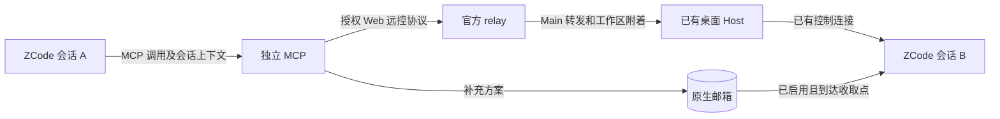

# ZCode 独立会话 MCP 能力探索（研究总览）

> 编者注：本文是 zcode-session-mcp 研究项目的结论总览，原样迁移自研究 README（2026-10-05 至 10-06）。
> 命名后端已剥离为 [suian-zcode-title](../../suian-zcode-title/) 插件并完成 Stop Hook 全自动端到端验证
> （原文"Stop Hook 未配置，授权仍需外部注入"为当时状态）；证据笔记随插件迁移至其 docs/notes/；
> 源码快照改为本仓库 sources/ 下的 submodule 引用。

核查日期：2026-10-05 至 2026-10-06。

跨对话接续入口：[ZCode 独立 MCP 会话管理研究交接报告](https://chatgpt.com/space/page_bb94352c7080819199088ec4e5b2267f)。Page 保存了核心结论、来源、脱敏证据附件和新对话接续提示。

**Stop 触发后的命名后端已搭好并完成真实验证**。入口见 [title-runner/README.md](../../suian-zcode-title/README.md)：SQLite 只读整理最近三轮，经原 Host 用 `GLM-5.3-Flash / low` 生成标题，再改名并核验双库。2026-10-06 21:31 的测试名称为“🧩 双链联想｜批次功能实施”；重复运行返回 unchanged，10 项自动化测试通过。Stop Hook 未配置，授权仍需外部注入。见 [脱敏证据](../../suian-zcode-title/docs/notes/stop-title-runner-evidence.json)。

**此前的传输验证**：2026-10-06 20:55:01，独立 Node 客户端通过官方远控授权连接，执行 `getTaskMeta → renameTask → getTaskMeta`，把“双链联想”改为“改名测试：双链联想”；原 Host 日志和两份数据库均确认成功。见 [外部改名实测](../../suian-zcode-title/docs/notes/external-host-rename-test.md) 及 [脱敏证据](../../suian-zcode-title/docs/notes/external-host-rename-evidence.json)。

[最近三轮聊天生成标题](../../suian-zcode-title/docs/notes/title-generation-audit.md) 与 [一次性模型生成](../../suian-zcode-title/docs/notes/one-shot-generation-audit.md) 已从静态审计推进到命名后端实测；通用生产 MCP、Stop 自动触发与授权续期仍未完成。

**可以在不 fork、不修改 ZCode 源码的前提下做独立 MCP**。本机 3.14.4 已验证第三方客户端使用用户提供的远控授权链接接入现有 Host 并调用改名。其他命令权限、持续连接和多客户端行为仍待验证。

这里的 **Host** 是桌面端持有工作区、任务状态和 Agent 子进程的后台服务。读取它的历史数据库，并不等于取得它正在运行的 Agent 的控制连接。

## Web 版补充结论

**产品已有连接现有桌面窗口的 Web 通信链**。独立部署 Web Host 的 `/ws` 管理它自己的服务；手机 Web 远控则经授权 relay 附着到既有桌面 Host，两者应分别适配。

3.14.4 安装包包含设备配对、工作区 bridge、RPC 帧转发，以及向现有 Host 交付 MessagePort 的实现。独立 MCP 可以作为这条链的客户端。官方公开的 3.14.3 快照缺少完整手机 relay 客户端，因此不能只凭公开快照缺失代码认定发布版没有入口。

早期静态审计见 [Web 通信接口与接入方案](../../suian-zcode-title/docs/notes/web-api-audit.md) 和 [官方手机远控审计](../../suian-zcode-title/docs/notes/web-remote-audit.md)。随后已使用用户提供的当前窗口授权链接完成外部配对和改名验证；没有重置远控。客户端原型尚未封装为 MCP。

## 已核实的能力

| 能力 | 结论 | 条件或边界 |
|---|---|---|
| 列出已有会话及任务元数据 | 可做 | 本机任务索引和会话库可用 SQLite 只读连接检查；结构属于内部实现，适配时需要版本检查 |
| 阅读历史内容 | 指定本地会话的最近三轮已实测 | SQLite 只读重建、可见消息过滤和持久化回退分支已实现；其余会话和远端工作区未覆盖 |
| 向独立桌面会话投递消息 | 找到授权 Web 输入路径，也有原生邮箱入口 | Web 客户端需完成配对；邮箱接收端需启用开关，真实投递均尚未测试 |
| 主动唤醒已空闲的桌面会话 | Web 远控有直接提交输入的协议路径 | 独立 MCP 的效果待配对实测；原生邮箱本身没有空闲唤醒保证 |
| 创建、续跑、停止、分叉 Agent | 协议提供这些操作 | 可控制 MCP 自己持有的 runtime；现有桌面 runtime 可沿授权 Web bridge 验证接入 |
| 接入桌面端已有会话所属 Host | 已通过外部 Web 客户端配对、工作区 bridge 和 getTaskMeta 实测 | 此次验证指定会话元数据与改名；活动输入、停止等未实测 |
| 重命名 | 外部客户端调用原 Host renameTask 已成功 | 两库只读回查一致；不直接 SQL 写标题 |
| 置顶、归档等桌面操作 | Controller/Task 服务有业务方法 | 尚未实测这些方法权限 |

本机证据见 [runtime-evidence.json](../../suian-zcode-title/docs/notes/runtime-evidence.json)，Host 与协议源码审计见 [source-audit.md](../../suian-zcode-title/docs/notes/source-audit.md)。

## 官方开源版本和本机版本

官方仓库是 [zai-org/ZCode](https://github.com/zai-org/ZCode)，已克隆到 `sources/official-zcode/`，没有 fork 或修改源码。

本次源码快照为 `29628c9acdb81b703bbd4080c207a0e7ce5e276e`，提交说明对应 3.14.3。仓库公开了 Desktop、Server、共享 UI、Agent CLI 和 Runtime 的主体源码。不过它的 NOTICE 对公开范围有明确限制，例如 CUA 存在占位实现；不能把这个仓库说成与所有官方发行功能完全一致。[S1]、[S1b]

本机实际检查对象：

- 应用：`D:\APP\_ForCoder\ZCode\ZCode.exe`，产品版本 `3.14.4.7912`。
- ASAR 包：`resources/app.asar`，包版本 `3.14.4`，入口 `out/main/index.js`。
- Agent CLI：`resources/glm/zcode.cjs`，`--version` 返回 `0.16.9`。
- 只读协议探针使用本机 Node.js `v24.15.0`，不是从克隆仓库构建的产物。

公开源码和本机发行版不是同一个版本。本机 bundle 还核实存在原生邮箱开关、邮箱 Hook、MCP 请求上下文和 session/V4 方法字符串；字符串存在只证明代码包含该功能，不等于已经验证真实消息投递。

## 原生邮箱可以减少通信部分的工作

**ZCode 已经带有跨会话的文件邮箱消费者**。Bootstrap 根据以下环境变量启用它：[S2]、[S2b]

```text
ZCODE_MESSAGE_ENABLED=1          # 或 true
ZCODE_MAILBOX_ROOT=<邮箱根目录>   # 默认 ~/.zcode/mailbox
```

这些变量需要被接收会话所属的 ZCode Runtime 继承。仅配置在 MCP 子进程的 `env` 中，不能据此认为父 Runtime 的消费者也已启用。本次没有修改启动方式或启用开关。

邮箱布局和消息契约在源码中已经定义：[S3]

```text
<邮箱根目录>/
└── sess_<接收会话 ID>/
    ├── unread/    # 等待消费者收取的 .json 文件
    └── read/      # 消费者读取后移入的文件
```

```json
{
  "version": 1,
  "messageId": "msg_<唯一 ID>",
  "fromSessionId": "sess_<发送会话 ID>",
  "toSessionId": "sess_<接收会话 ID>",
  "content": "交给接收 Agent 的参考信息",
  "createdAt": "2026-10-05T00:00:00.000Z"
}
```

消费者在三个收取点运行：[S4]

1. `UserPromptSubmit`：提交新提示时加入上下文。
2. `PostToolUse`：工具执行结束后，将消息排入当前轮次的引导输入。
3. `Stop`：准备结束回答时，如果还有消息，加入上下文并要求继续。

这可以让运行中的 Agent 在执行边界接收其他会话的信息。代码不提供“任何时候立即打断模型”的保证，也没有在这个消费者中看到空闲后台轮询器。

`read/` 表示邮箱适配器已经取走文件。它不是模型已经处理或回复的确认；源码中也存在后续引导输入被拒绝的处理。因此 MCP 应区分“已入队”“已被邮箱收取”和“对方已回复”。[S3]、[S4]、[S4b]

ZCode 原生 `SendMessage` 的默认说明和调用链面向本地子 Agent，使用 `subagentPort.sendMessage`。不能直接把它等同于任意独立桌面会话的发信接口。[S5]

## MCP 可以识别当前调用会话

**无需默认让模型手填发送方会话 ID**。ZCode 的 MCP 适配器在调用具备 Trace、Runtime 或工作区上下文时，为 `tools/call` 添加 `_meta`；其中可包含：

```json
{
  "session_id": "sess_...",
  "turn_id": "turn_...",
  "workspace_path": "D:\\CODE\\...",
  "com.zcode/request-context": {
    "session_id": "sess_...",
    "workspace_path": "D:\\CODE\\..."
  }
}
```

这是源码中已有的 ZCode 扩展，不是 MCP 通用规范保证的字段。字段缺失时应返回明确的未识别状态，或通过 Hook 注册补足；不能假设每次请求都有完整身份。标识字段本身也不是鉴权凭证。[S6]、[S6b]

若需要通过 Hook 注册，配置型 Hook 的运行环境已有 `ZCODE_SESSION_ID` 和 `ZCODE_PROJECT_DIR`。[S7]

## app-server 有控制协议，但控制范围属于持有它的进程

本机随附 CLI 有 `app-server` 子命令。它使用 stdio，协议中包括 `session/create`、`session/list`、`session/read`、`session/resume`、`session/send`、`session/subscribe`、`session/stop`、`session/fork`，也有新的 V4 命令和订阅通道。相关 schema 和操作路由已经在源码中公开。[S8]

每个协议服务实例构造自己的 `sessions: new Map()`。桌面 Host 持有它启动的 CLI 的 stdio 管道。另起一个 CLI 即使使用相同数据库，也不会自动得到那个实例中的活动 Prompt、订阅或停止控制权。[S9]

两个容易误判的细节：

- `session/read`、`session/subscribe` 需要目标已经驻留于当前实例；不能认为它们会直接读取任意持久化会话。历史读取适配器和 Runtime 恢复操作应分开。[S8b]
- 本次公开源码中的 legacy `session/send` 遇到活动 Prompt 会拒绝请求。需要排队或引导输入时，V4 `sendText` 的 `requestedDelivery` 才明确区分 `startNow`、`queue`、`guide`；不能照搬旧社区文档的 busy 即 steer 说法。[S10]、[S10b]

独立 HTTP Host 的源码有 WebSocket 和 Host 能力接口，但它创建自己的服务和 ProcessManager，不会自动成为当前桌面 Host 的连接。把桌面和 MCP 都接到同一个独立 Host，是另一种可能的部署方案，尚未做本机端到端验证。

本机发现后台 Host 监听 `127.0.0.1:49571`。端口用途未完成核实，本次没有向它发送请求，也没有把它作为会话 RPC 入口。

社区已有 [zcode-open-bridge](https://github.com/tizerluo/zcode-open-bridge) 这样的 MCP/ACP 桥接项目。本次也克隆了它作只读参考；它启动自己的 app-server，支持的是这条控制链，不能据此推定能接管桌面端已有的活动会话。具体代码依据见源码审计报告。

## 建议先做的独立 MCP

**授权 Web 连接、指定任务读取和改名已验证，可以据此设计独立 MCP**。生产适配还需验证授权失效、断线恢复和工作区切换。原生邮箱与独立 app-server 保留为补充方案。

可以先提供以下工具；名称是建议设计，不是 ZCode 已有工具：

| 建议工具 | 实现方向 |
|---|---|
| `get_current_session` | 读取当前请求 `_meta`，返回已识别的会话和工作区 |
| `list_sessions` | 优先读取授权窗口的 Controller；也可提供只读索引适配并标明来源 |
| `read_session` | 通过目标工作区会话服务读取；持久化历史适配需标明不同语义 |
| `send_session_message` | 验证目标后提交 V4 输入；原生邮箱作为备选 |
| `get_message_status` | 区分命令被接收、消息被处理与对方回复；不能把 ACK 当作完成 |



连接、读取和投递验证后，再增加创建、续跑、停止和分叉。多个 Agent 的工具宜共用一个远控连接服务，工作区切换与并发语义需要实测。独立 app-server 仍可用于 MCP 自己创建的任务，但不能只凭共享数据库接管桌面任务。

## 本次验证与未执行事项

**已验证**：

- 本机产品版本、ASAR 包入口、随附 CLI 版本和帮助。
- 本机 CLI 在隔离配置、Provider 配置副本和数据库目录中启动。
- `runtime/capabilities` 返回 `{"independentPlanState":true}`。
- `session/list` 返回 `{"sessions":[]}`；这是新建隔离环境的空列表。
- 上述探针和隔离子进程均正常退出，退出码为 0。
- 最初只读检查真实库结构；后续按用户指定读取目标会话的 ID、工作区和标题，并用 `sqlite3 -readonly`、`query_only` 回查改名。
- 独立 Node 客户端通过远控 relay 附着原 Host PID 39048，完成指定会话的 getTaskMeta、renameTask 和读回，退出码 0。
- 官方分帧编码器和组装器通过 900,000 字节、两片消息的往返检查。

隔离启动需要同时设置 `ZCODE_STORAGE_DIR`、`ZCODE_SESSION_DB_PATH`、`ZCODE_DATA_BASE_DIR`。启动 app-server 本身可能执行存储初始化或迁移，因此不能拿真实会话库作为无副作用的探针环境。[S11]

本机 Node 直接启动随附 bundle 时，还需要显式指定 Provider 配置。探针将随附的公开内置 Provider 配置复制到隔离目录，设置 `ZCODE_BUILTIN_PROVIDER_CONFIG_FILE`、`ZCODE_BUILTIN_PROVIDER_BUNDLED_CONFIG_FILE` 和 `ZCODE_PERSONAL_PROVIDER_CONFIG_FILE`，没有复制用户凭据。[S12]

本次没有向真实 Agent 会话发送工作指令、创建普通 Agent 任务、修改用户凭据或直接用 SQL 写库，也没有构建生产 MCP。已按用户授权调用辅助命名模型，读取指定会话最近三轮，并通过原 Host 改名。邮箱投递、空闲唤醒和其余控制命令仍待验证。

临时探针、提取出的 ASAR 文件、隔离 Profile 和诊断日志在验证后删除。保留最终研究报告、脱敏证据和只读源码克隆。

## 源码依据

以下链接固定到本次官方源码快照，版本范围均为该快照。

[S1]: https://github.com/zai-org/ZCode/tree/29628c9acdb81b703bbd4080c207a0e7ce5e276e
[S1b]: https://github.com/zai-org/ZCode/blob/29628c9acdb81b703bbd4080c207a0e7ce5e276e/NOTICE.md#L24
[S2]: https://github.com/zai-org/ZCode/blob/29628c9acdb81b703bbd4080c207a0e7ce5e276e/apps/zcode-cli/packages/bootstrap/src/app/create-app.ts#L358-L367
[S2b]: https://github.com/zai-org/ZCode/blob/29628c9acdb81b703bbd4080c207a0e7ce5e276e/apps/zcode-cli/packages/bootstrap/src/app/app-config-options.ts#L6-L8
[S3]: https://github.com/zai-org/ZCode/blob/29628c9acdb81b703bbd4080c207a0e7ce5e276e/apps/zcode-cli/packages/adapters/src/mailbox/index.ts#L17-L80
[S4]: https://github.com/zai-org/ZCode/blob/29628c9acdb81b703bbd4080c207a0e7ce5e276e/apps/zcode-cli/packages/core/src/hooks/session-mailbox.ts#L11-L58
[S4b]: https://github.com/zai-org/ZCode/blob/29628c9acdb81b703bbd4080c207a0e7ce5e276e/apps/zcode-cli/packages/core/src/runtime/helpers/runtime-tools.ts#L121-L139
[S5]: https://github.com/zai-org/ZCode/blob/29628c9acdb81b703bbd4080c207a0e7ce5e276e/apps/zcode-cli/packages/core/src/tool/handlers/send-message.ts#L23-L82
[S6]: https://github.com/zai-org/ZCode/blob/29628c9acdb81b703bbd4080c207a0e7ce5e276e/apps/zcode-cli/packages/adapters/src/mcp/index.ts#L691-L700
[S6b]: https://github.com/zai-org/ZCode/blob/29628c9acdb81b703bbd4080c207a0e7ce5e276e/apps/zcode-cli/packages/adapters/src/mcp/index.ts#L1748-L1773
[S7]: https://github.com/zai-org/ZCode/blob/29628c9acdb81b703bbd4080c207a0e7ce5e276e/apps/zcode-cli/packages/core/src/hooks/configured-runner-input.ts#L73-L99
[S8]: https://github.com/zai-org/ZCode/blob/29628c9acdb81b703bbd4080c207a0e7ce5e276e/apps/zcode-cli/packages/bootstrap/src/zcode-protocol/server.ts#L567-L641
[S8b]: https://github.com/zai-org/ZCode/blob/29628c9acdb81b703bbd4080c207a0e7ce5e276e/apps/zcode-cli/packages/bootstrap/src/zcode-protocol/server-operations.ts#L1822-L1915
[S9]: https://github.com/zai-org/ZCode/blob/29628c9acdb81b703bbd4080c207a0e7ce5e276e/apps/zcode-cli/packages/bootstrap/src/zcode-protocol/server.ts#L245-L267
[S10]: https://github.com/zai-org/ZCode/blob/29628c9acdb81b703bbd4080c207a0e7ce5e276e/apps/zcode-cli/packages/bootstrap/src/zcode-protocol/server-operations.ts#L1918-L1937
[S10b]: https://github.com/zai-org/ZCode/blob/29628c9acdb81b703bbd4080c207a0e7ce5e276e/packages/shared/src/zcode-protocol-v4/command.ts#L81-L87
[S11]: https://github.com/zai-org/ZCode/blob/29628c9acdb81b703bbd4080c207a0e7ce5e276e/apps/zcode-cli/packages/bootstrap/src/zcode-protocol-entrypoint.ts#L136-L153
[S12]: https://github.com/zai-org/ZCode/blob/29628c9acdb81b703bbd4080c207a0e7ce5e276e/apps/zcode-cli/packages/cli/src/provider-runtime-env.ts#L52-L102
