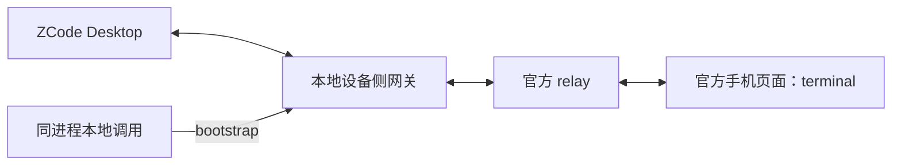

# 设备侧 relay 网关原型

**实验问题**：能否让 ZCode 的设备连接经过本地网关，继续连接官方 relay，同时在网关内分流本地请求，从而保留官方手机页面？

**当前结论**：选路与认证消息转发有静态依据；模拟共存测试通过；公网官方 relay 已通过网关返回 `auth_challenge`。真实桌面端认证、手机共存与 V4 RPC 控制尚未验证。

这是 `prototype/zcode-relay-gateway` 分支上的临时原型，未接入正式 MCP。正式的两个 SQLite 只读工具可以直接与手机共存。

## 拓扑与地址



网关上游只有一个设备连接，本地调用不创建第二个 `terminal`。网关将 Desktop 的 `mid` 查询参数和 `X-Device-ID` 握手头带到上游。

| 项目 | 已核实值 |
| --- | --- |
| 生产默认 relay | `wss://zcode.z.ai/ws` |
| 另一 endpoint 的 relay | `wss://zcode.chatglm.site/ws`，由 endpoint 配置选择，不是自动故障切换 |
| Desktop 启动时覆盖 relay 的环境变量 | `ZCODE_WEB_REMOTE_CONTROL_RELAY_WS_URL` |
| 本地示例地址 | `ws://127.0.0.1:17329/ws` |

环境变量由 **Desktop 主进程启动时读取**。让它生效需要退出原主进程，再从持有该变量的环境启动 ZCode；只打开一个复用原主进程的新窗口不能完成切换。本轮未修改启动环境或重启 ZCode。

持久授权的 `auth_init` 携带 `role: device` 和 `device_sid`。Desktop 本地计算 `auth_response.proof`；网关原样转发挑战及回应，无需读取保存的凭据。首次注册另有 `device_register_init`，其内容同样仅经过转发，不写日志。

## 原型入口

```powershell
npm ci --ignore-scripts --no-audit --no-fund
node gateway.mjs 17329
```

以上命令在本目录执行，只启动网关。实际 Desktop 切换时使用的配置为：

```powershell
$env:ZCODE_WEB_REMOTE_CONTROL_RELAY_WS_URL = 'ws://127.0.0.1:17329/ws'
```

这项变量只影响该 PowerShell 及其随后创建的子进程，之后需从该环境启动新的 Desktop 主进程。

`startGateway()` 返回 `url`、`bootstrap({ timeoutMs })` 和 `close()`。`bootstrap()` 在启动网关的**同一个 Node 进程**内调用；独立 CLI 当前只做转发，尚无跨进程调用入口。

本地请求只能在上游报告 `matched` 后注入。返回值是完整的 `bootstrap-response` payload，调用方按 `success` 判断业务结果。手机请求原样传递；本地请求及其迟到回复按 `requestId` 留在本地。

## 已完成验证

2026-10-07，Node 24.15.0、ws 8.22.0，四项契约全部通过：

1. 设备认证消息体、文本/二进制类型、`mid` 与握手头保持；第二个 Desktop 被拒绝。
2. 两个本地 bootstrap 乱序返回，手机 bootstrap 仍通过唯一上游连接正常往返。
3. 上游 `waiting` 状态拒绝本地请求，并结束尚未完成的请求。
4. 超时或断开明确失败；超时后的本地迟到回复不会发给手机。

这四项使用回环 WebSocket 模拟 relay 与 Desktop。完整测试输出先落盘，再提炼到 [evidence.json](evidence.json)，原始日志已清理。

`node probe-official.mjs` 使用临时随机 `mid`/`sid`，经过网关向官方 relay 发送一次 `terminal auth_init`。实际收到 `auth_challenge`，未发送 `auth_response`，未完成鉴权。探针不会读取用户链接、凭据或会话，也不会提交 Agent 任务。脱敏结果写入忽略的 `.scratch/`。

## 继续验证的边界

**手机离线**：Desktop 收到初始 `waiting` 时会忽略所有 `data`，所以当前原型不能离线注入。下一项可检验在真实设备认证成功后由网关向 Desktop 提供虚拟 `matched`，并持续处理约每 10 秒一次的配对状态查询。此方案仍是待验证推断，当前代码未实现。

**向会话提交消息**：bootstrap 只返回远控元数据。提交 prompt 或改名需要 V4 workspace bridge 与 RPC。它们还涉及数字请求 ID、订阅、bridge session/generation 和 ACK；当前的外层 `requestId` 分流不覆盖这些协议。Desktop 的单一 `currentBridge` 也需要协调，不能据此声称已完成跨会话发信。

**长期运行**：原型只保留消息级转发，没有实现关闭码透传、背压策略、完整重连或独立 MCP 接口。本地请求 ID 在单次连接内保留到断开，用于消耗迟到回复。它只绑定回环地址，尚未设计入站身份认证与浏览器 Origin 限制；真实常驻部署需要另行设计。

## 来源

静态依据为 ZCode 3.14.4 安装包的 `resources/app.asar`；本轮重新计算的 SHA-256 为 `172D6F333E61642CE3882250949FAFE8180F75B5B8E5552244CA2C59CA05D14E`。固定产物中的定位记录见 [evidence.json](evidence.json)，offset 指 UTF-16 字符偏移。

- `out/main/chunk-SPTKPKUJ.js` 第 1 行：默认地址 offset 1223，覆盖逻辑 offset 3332。
- `out/main/index.js` 第 1367 行 offset 708268：启动环境变量。
- 同文件第 408 行：`mid` offset 375751，握手头 offset 376219，认证回应 offset 378433，配对状态门 offset 380558。
- [公开 3.14.3 源码的 deviceMid 来源](https://github.com/zai-org/ZCode/blob/29628c9acdb81b703bbd4080c207a0e7ce5e276e/packages/desktop/src/main/desktopDeviceMid.ts#L30-L45)：固定提交，仅用于补充 mid 的持久化来源。
