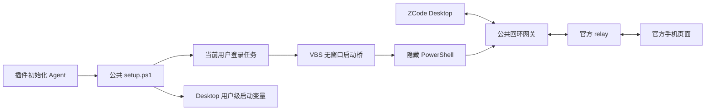

# suian-zcode-common

**两个插件共用的基础能力**：网关、远控协议与探活、DPAPI、Toast 和消息投影。命名插件保留命名规则、Stop Hook、通知文案及自有协议；MCP 保留工具契约与 SQLite 适配。公共层不依赖任何插件。

只有网关是常驻独立进程，其他模块由调用方导入，按需执行。共享代码不等于合并运行数据或给只读 MCP 增加通知。



网关绑定 `127.0.0.1`，保留认证消息体、文本/二进制类型、Desktop 的 `mid` 与 `X-Device-ID` 握手头。认证证明仍由 Desktop 生成；网关不读取远控链接或 ZCode 保存的凭据，不记录消息正文。

## 模块与数据归属

| 模块 | 公共接口与调用方 |
| --- | --- |
| gateway.mjs | `startGateway()`：独立网关；同进程 `bootstrap()`、`close()` |
| remote.mjs | `connectRemote()`、`probeRemote()`、`startRelay()`：使用传入授权；当前命名流程调用 |
| auth-store.mjs | `saveAuthorization({dataDir,url})`、`loadAuthorization({dataDir})`、`clearAuthorization({dataDir})` |
| title-policy.mjs | MCP 写入、命名插件读取的独立锁定策略；默认在 `~/.zcode/tools/suian-zcode-common/session-titles` |
| notifications.mjs | `notifyOnce({dataDir,title,message,reasonCode,appId,actionUri})`；保留两小时冷却、跨进程互斥及显示失败结果 |
| notification-action.mjs | `copyPromptAndOpenWorkspace({prompt,dataDir})`：复制调用方提示词后打开用户默认工作区；仅用户点击后执行 |
| notification-install.mjs | `installToastAssets()` / `removeToastAssets()`：接收调用方的 protocol、appId、shortcutName、description、pluginRoot、dataDir |
| vendor/projection.js | `getConversationMessageProjectionPolicy()`：两个插件引用同一固定产物 |

调用方继续指定自己的数据目录和通知身份。命名插件的 `.local/remote.blob`、Toast 冷却、`suian-zcode-title://` 协议和 AUMID 不迁移；公共网关配置不保存远控授权。MCP 的两个读取工具共享投影库，五个写工具共享远控与 DPAPI 模块，授权目录由 MCP 配置。会话命名策略是明确跨插件共享的新数据，其他授权和通知状态保持调用方归属。

通知模块的系统动作可注入，用于隔离测试；自动化验证不能触发真实协议或 ZCode 的外部工作区确认框。测试按两个不同调用方的身份安装/卸载验证隔离，这不代表 MCP 已启用 Toast。

## Agent 配置入口

读取 [SKILL.md](./SKILL.md)，按完整流程操作。需要 Windows、Node.js 24+，依赖固定为 ws 8.22.0：

```powershell
npm ci --ignore-scripts --no-audit --no-fund
powershell.exe -NoProfile -NonInteractive -ExecutionPolicy Bypass -File .\setup.ps1 -Action Status
powershell.exe -NoProfile -NonInteractive -ExecutionPolicy Bypass -File .\setup.ps1 -Action Install
```

Install 通过 `wscript.exe` 的 VBS 启动桥立即启动当前用户的登录任务，验证健康接口后写用户级 `ZCODE_WEB_REMOTE_CONTROL_RELAY_WS_URL`，默认 `ws://127.0.0.1:17329/ws`。默认数据目录 `~/.zcode/tools/suian-zcode-gateway` 由两个插件共用，路径为兼容旧安装保留；公共 skill 现在部署到 `~/.zcode/skills/suian-zcode-common`。重复安装复用运行中的实例和原始环境备份。

**安装不会重启 ZCode**。该变量在 Desktop 主进程启动时读取，放在 Hook 或 MCP 子进程的环境中无法切换 Desktop。先完成运行中的任务、保存工作，再完整退出并从读取最新用户变量的外部 PowerShell 启动；同次登录中已有的终端或 Explorer 可能仍持有旧环境。具体启动命令与生效验证统一见 [公共 skill](./SKILL.md)。

Install 可指定 `-Port {{port}}` 和 `-UpstreamUrl {{relay_url}}`。未指定时保留已配置值；上游默认为 `wss://zcode.z.ai/ws`。另一 endpoint 使用 `wss://zcode.chatglm.site/ws`，由实际 endpoint 选择，不能当作自动故障切换。Install 遇到不同运行根时明确失败，避免悄悄切断远控。更新代码或从旧 `suian-zcode-gateway` 目录迁移后，用 `setup.ps1 -Action Restart` 重载：Desktop 已断开才允许退出旧网关，等旧启动器退出后更新同一任务；保留端口、上游、控制令牌和原环境备份。

VBS 使用 `Run(..., 0, True)` 隐藏 PowerShell，并等待子进程、返回真实退出码；PowerShell 再等待隐藏 Node。这使任务保持运行，并保留非零退出后每分钟重试、最多三次的设置。运行用 `gateway-launch.vbs` 部署在公共数据目录，避免让常驻 WScript 使用 Git 工作树中的模板。当前版本的模板为 `run.vbs`。

Remove 只在用户要求移除公共网关时执行，先完整退出 ZCode。它通过本工具的本地令牌让 Node 网关自行退出，再移除任务并恢复安装前的用户环境；如果变量已被外部修改，则保留外部值。单独卸载任一插件不移除公共网关。

## 健康状态与本地接口

`setup.ps1 -Action Status` 汇报配置、用户环境、启动任务、Desktop、上游与配对状态。`gateway_running` 来自实际 HTTP 健康结果，`task_running` 单独报告计划任务状态；任务 Ready 不代表 Node 已停止。`gateway_running` 不等于远控已经开启；`desktop_connected` 才能证明有 Desktop 连接网关。默认 HTTP 健康地址为 `http://127.0.0.1:17329/health`。

健康请求默认每次等 5 秒，仅超时时重试一次；需要调整时使用 `-HealthTimeoutSec {{seconds}}`（1–30）。`health_status` 区分未配置、可达和连接失败（`not_configured` / `reachable` / `unreachable`）。连续超时明确报运行状态未知，不输出一个成功的 `gateway_running:false` 来代替；其他错误照实报出。移除与重载直接检查网关，不依赖任务是否 Running；停止后须等 HTTP 监听与旧启动器都结束才改配置。

`vbs_launcher` 表示任务是否使用 VBS。`launcher_update_required` 表示旧入口待切换或任务已结束、未继续监督存活网关；需要恢复时先结束运行中工作、完整退出 Desktop，再执行 Restart。安装会复用仍存活的网关，避免再开一个进程。

| 接口 | 范围 |
| --- | --- |
| WebSocket `/ws` | 一个 Desktop，原样转发至官方 relay；第二个 Desktop 被拒绝 |
| GET `/health` | 工具版本、安装标识、上游地址、连接与配对布尔值；不含凭据或消息正文 |
| POST `/shutdown` | 仅供公共移除与重载流程，要求本地 Bearer 令牌，且无 Desktop 连接；不是 ZCode 远控 RPC |

带浏览器 `Origin` 的 HTTP 或 WebSocket 连接均拒绝。`config.json` 中的 `control_token` 仅控制本地网关停止，不是 ZCode 授权；不要把完整配置、令牌或请求头贴入报告和日志。启动任务的 Node 输出只包含就绪地址和错误类别，日志在公共数据目录。

前台调试可使用 `node gateway.mjs --port 17329`；正式任务由 VBS 隐藏启动 `run.ps1`，读取公共配置。不要同时开第二个实例，不要在两个插件各自 `.local` 建另一套公共配置。

## 更新文件与重新启动

本机 Windows / Node 24.15.0 的隔离实验中，运行网关时 Git 成功替换已加载的 JS，`ws` 模块文件与整个源码目录可重命名。网关仍运行旧代码，必须 Restart 才加载新版本；模块缓存语义见 [Node.js ESM 文档](https://nodejs.org/api/esm.html#urls)。该实验不覆盖第三方进程占用、杀毒软件或原生扩展锁定。

网关持续写入的日志在上述数据目录，源码目录不承担运行日志。新公共层保持旧网关的任务名和健康 `service:suian-zcode-gateway`，避免创建第二个后台进程。目录改名后启动任务的脚本路径需要由 Restart 更新，不能只执行 Git 更新就宣称升级完成。

安装/升级后的生效方法见公共 skill。**不要求以后永远从 PowerShell 启动 ZCode**；重新登录 Windows 后普通快捷方式通常继承新环境。同次登录仍持旧环境的启动器才需要显式读取变量后重开，并用 `desktop_connected` 验证。

## 已验证范围

真实 ZCode 3.14.4 上已验证设备连接经网关鉴权，以及同进程 `bootstrap()` 元数据读取与官方手机页面共存：[真实共存报告](../suian-zcode-app-mcp/docs/relay-gateway-coexistence.md)。历史来源和固定安装包定位保留在 [阶段证据](../suian-zcode-app-mcp/experiments/relay-gateway/evidence.json)。既有网关配置验收见 [setup-evidence.json](./docs/setup-evidence.json)，公共层提取、重载与文件更新验证见 [common-layer-evidence.json](./docs/common-layer-evidence.json)。

`startGateway()` 提供 `url`、同进程 `bootstrap({timeoutMs})` 与 `close()`。bootstrap 只在官方上游报告 `matched` 后注入，本地回复及迟到回复不发给手机；当前没有跨进程 bootstrap 或 V4 RPC 入口。网关内的完整 workspace bridge、改名、提交 prompt 与手机离线注入仍需后续实现；自动命名与 MCP 写工具的独立 terminal 仍受官方席位限制。MCP 两个 SQLite 只读工具可独立与手机共存。

当前没有独立的上游重连或背压队列策略；断开交还 Desktop 自己处理，WebSocket 关闭码未透传。本地 bootstrap 的 requestId 在连接内保留到断开，用于消耗迟到回复。需要长期压力验证后才能扩大运行保证。

`npm test` 覆盖网关、远控、DPAPI、通知、真实 VBS → PowerShell → Node 的隔离启动链，以及模拟系统边界的安装与升级配置。独立子进程验证控制台不可见与非零退出码传递；不会注册真实用户任务或改真实环境。未鉴权公网探针 `experiments/probe-official.mjs` 仅供研究，不在安装或测试时自动执行。

Windows 任务参数依据 [Register-ScheduledTask](https://learn.microsoft.com/en-us/powershell/module/scheduledtasks/register-scheduledtask)、[任务身份](https://learn.microsoft.com/en-us/powershell/module/scheduledtasks/new-scheduledtaskprincipal) 和 [任务设置](https://learn.microsoft.com/en-us/powershell/module/scheduledtasks/new-scheduledtasksettingsset)。采用 Interactive/Limited 当前用户身份，不保存账户密码。VBS 使用批处理模式避免脚本错误弹窗，入口参数见 [wscript](https://learn.microsoft.com/en-us/windows-server/administration/windows-commands/wscript)。健康超时参数见 [Invoke-RestMethod](https://learn.microsoft.com/en-us/powershell/module/microsoft.powershell.utility/invoke-restmethod?view=powershell-5.1)。停止时让 Node 自行退出并等待启动链结束，避免只停止外层启动器：[Start-Process](https://learn.microsoft.com/en-us/powershell/module/microsoft.powershell.management/start-process)。

自有代码沿用仓库 [MIT 许可](../LICENSE)。固定协议与消息投影库的来源和 Apache-2.0 许可见 [vendor/NOTICE.md](./vendor/NOTICE.md)。
