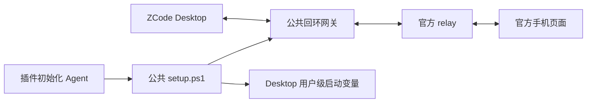

# suian-zcode-gateway

**两个插件共用的设备侧 relay 网关**。`suian-zcode-title` 与 `suian-zcode-app-mcp` 的 Agent 初始化都调用本子项目；转发实现、Windows 启动和环境变量配置只维护一份。



网关绑定 `127.0.0.1`，保留认证消息体、文本/二进制类型、Desktop 的 `mid` 与 `X-Device-ID` 握手头。认证证明仍由 Desktop 生成；网关不读取远控链接或 ZCode 保存的凭据，不记录消息正文。

## Agent 配置入口

读取 [SKILL.md](./SKILL.md)，按完整流程操作。需要 Windows、Node.js 24+，依赖固定为 ws 8.22.0：

```powershell
npm ci --ignore-scripts --no-audit --no-fund
powershell.exe -NoProfile -NonInteractive -ExecutionPolicy Bypass -File .\setup.ps1 -Action Status
powershell.exe -NoProfile -NonInteractive -ExecutionPolicy Bypass -File .\setup.ps1 -Action Install
```

公共入口立即启动当前用户的登录任务，验证健康接口后写用户级 `ZCODE_WEB_REMOTE_CONTROL_RELAY_WS_URL`，默认 `ws://127.0.0.1:17329/ws`。默认数据目录 `~/.zcode/tools/suian-zcode-gateway` 与部署 skill 由两个插件共用；重复安装复用运行中的实例和原始环境备份。

**安装不会重启 ZCode**。该变量在 Desktop 主进程启动时读取，放在 Hook 或 MCP 子进程的环境中无法切换 Desktop。先完成运行中的任务、保存工作，再完整退出并从读取最新用户变量的外部 PowerShell 启动；同次登录中已有的终端或 Explorer 可能仍持有旧环境。具体启动命令与生效验证统一见 [公共 skill](./SKILL.md)。

Install 可指定 `-Port {{port}}` 和 `-UpstreamUrl {{relay_url}}`。未指定时保留已配置值；上游默认为 `wss://zcode.z.ai/ws`。另一 endpoint 使用 `wss://zcode.chatglm.site/ws`，由实际 endpoint 选择，不能当作自动故障切换。运行中实例的地址或安装根不一致时明确失败，避免悄悄切断远控。

Remove 只在用户要求移除公共网关时执行，先完整退出 ZCode。它通过本工具的本地令牌让 Node 网关自行退出，再移除任务并恢复安装前的用户环境；如果变量已被外部修改，则保留外部值。单独卸载任一插件不移除公共网关。

## 健康状态与本地接口

`setup.ps1 -Action Status` 汇报配置、用户环境、启动任务、Desktop、上游与配对状态。`gateway_running` 不等于远控已经开启；`desktop_connected` 才能证明有 Desktop 连接网关。默认 HTTP 健康地址为 `http://127.0.0.1:17329/health`。

| 接口 | 范围 |
| --- | --- |
| WebSocket `/ws` | 一个 Desktop，原样转发至官方 relay；第二个 Desktop 被拒绝 |
| GET `/health` | 工具版本、安装标识、上游地址、连接与配对布尔值；不含凭据或消息正文 |
| POST `/shutdown` | 仅供公共移除流程，要求本地 Bearer 令牌，且无 Desktop 连接；不是 ZCode 远控 RPC |

带浏览器 `Origin` 的 HTTP 或 WebSocket 连接均拒绝。`config.json` 中的 `control_token` 仅控制本地网关停止，不是 ZCode 授权；不要把完整配置、令牌或请求头贴入报告和日志。启动任务的 Node 输出只包含就绪地址和错误类别，日志在公共数据目录。

前台调试可使用 `node gateway.mjs --port 17329`；正式启动任务由 `run.ps1` 读取公共配置。不要同时开第二个实例，不要在两个插件各自 `.local` 建另一套公共配置。

## 已验证范围

真实 ZCode 3.14.4 上已验证设备连接经网关鉴权，以及同进程 `bootstrap()` 元数据读取与官方手机页面共存：[真实共存报告](../suian-zcode-app-mcp/docs/relay-gateway-coexistence.md)。历史来源和固定安装包定位保留在 [阶段证据](../suian-zcode-app-mcp/experiments/relay-gateway/evidence.json)。当前配置与契约验收见 [setup-evidence.json](./docs/setup-evidence.json)。

`startGateway()` 提供 `url`、同进程 `bootstrap({timeoutMs})` 与 `close()`。bootstrap 只在官方上游报告 `matched` 后注入，本地回复及迟到回复不发给手机；当前没有跨进程 bootstrap 或 V4 RPC 入口。完整 workspace bridge、改名、提交 prompt 与手机离线注入仍需后续实现；自动命名的独立 terminal 仍受官方席位限制。MCP 两个 SQLite 只读工具可独立与手机共存。

当前没有独立的上游重连或背压队列策略；断开交还 Desktop 自己处理，WebSocket 关闭码未透传。本地 bootstrap 的 requestId 在连接内保留到断开，用于消耗迟到回复。需要长期压力验证后才能扩大运行保证。

`npm test` 覆盖回环 WebSocket、独立 CLI、真实 Windows 隐藏启动进程，以及模拟系统边界的配置测试；不会注册真实用户任务或改真实环境。未鉴权公网探针 `experiments/probe-official.mjs` 仅供研究，不在安装或测试时自动执行。

Windows 任务参数依据 [Register-ScheduledTask](https://learn.microsoft.com/en-us/powershell/module/scheduledtasks/register-scheduledtask)、[任务身份](https://learn.microsoft.com/en-us/powershell/module/scheduledtasks/new-scheduledtaskprincipal) 和 [任务设置](https://learn.microsoft.com/en-us/powershell/module/scheduledtasks/new-scheduledtasksettingsset)。采用 Interactive/Limited 当前用户身份，不保存账户密码。Windows 启动进程独立于调用 shell，因此停止时让 Node 自行退出，避免只停止外层启动器：[Start-Process](https://learn.microsoft.com/en-us/powershell/module/microsoft.powershell.management/start-process)。

自有代码沿用仓库 [MIT 许可](../LICENSE)。
